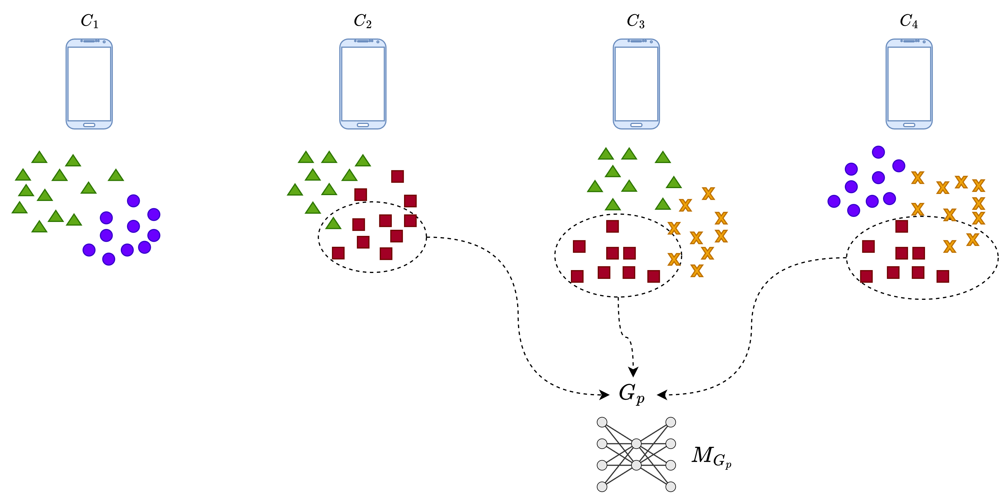

# FL Cluster

This is the code for the paper:

**Federated clustering: An unsupervised cluster-wise training for decentralized data distributions**
Future Generation Computer Systems, Volume 178, May 2026, 108294

[](https://www.sciencedirect.com/science/article/pii/S0167739X25005886)
[](https://arxiv.org/abs/2408.10664)

## Overview



*N=4 clients, each holding a local dataset with K_i unique data distributions (dotted lines show local -imperfect- cluster splits). The goal is to identify the set of global distributions U (K_G=4, shown as distinct shapes) across all clients.*

The system discovers client communities in federated learning environments through reconstruction error analysis. Clients train local autoencoders on their data partitions without sharing raw data. Reconstruction errors across clients serve as a similarity signal — low error indicates similar data distributions. An association graph is built from these errors and decomposed into communities, which drive cluster-wise federated training across iterations.

## Project Structure

```
fl_cluster/
├── main.py                 # Entry point
├── dev.py                  # Dev (FL client) class
├── dev_manager.py          # DevManager class
├── keras_dec.py            # Deep Embedding Clustering
├── my_config.py            # All experiment settings
│
└── utils/
    ├── util_data.py        # Dataset loading and non-IID distribution
    ├── util_models.py      # Autoencoder architectures and caching
    ├── util_dev.py         # Clustering metrics and helpers
    ├── util_graph.py       # Graph utilities for client associations
    ├── fl_client.py        # Flower FL client
    └── fl_server.py        # Flower FL server
```

## Key Components

### Core Classes

- **Dev** (`dev.py`): Represents a federated learning client/device
  - Handles clustering (DEC, oracle, dirty uniform, proximity-based)
  - Manages autoencoder training and prediction
  - Tracks reconstruction errors and client associations
  - Computes clustering accuracy metrics (ARI, NMI)

- **DevManager** (`dev_manager.py`): Orchestrates multiple devices
  - Parallel training using Ray
  - Association analysis across clients
  - Community detection via graph analysis

- **DeepEmbeddingClustering** (`keras_dec.py`): DEC algorithm implementation
  - Custom clustering layer
  - Pretraining and fine-tuning
  - KMeans initialization

### Utilities

- **util_data.py**: Dataset loading (MNIST, Fashion-MNIST, EMNIST, KMNIST) and non-IID client data distribution
- **util_models.py**: Autoencoder models with caching and inference optimization
- **util_dev.py**: Clustering accuracy, distance metrics, hash generation
- **util_graph.py**: Graph building for client association networks

## Libraries

- **DL**: TensorFlow/Keras
- **Distributed**: Ray, Pebble, Flower (flwr)
- **Experiment Tracking**: Weights & Biases (wandb)
- **Data**: NumPy, Pandas, Scikit-learn
- **Caching**: Joblib

## Workflow

1. **Initialization**
   - Load dataset (MNIST, Fashion-MNIST, EMNIST, etc.)
   - Distribute data among clients (non-IID with class subsets)
   - Create Dev objects for each client

2. **Initial Clustering Phase**
   Choose one strategy:
   - **Oracle**: Ground truth baseline mapping
   - **DEC**: Deep Embedding Clustering (unsupervised)
   - **Dirty Uniform**: Simulated clustering noise (uniform)
   - **Dirty Proximity**: Simulated clustering noise (proximity-based)

3. **Iterative Community Discovery**
   ```
   For each iteration:
   ├── Train local autoencoders (parallel via Ray)
   ├── Predict on all clients' data using all models
   ├── Compute reconstruction errors (cached)
   ├── Associate clients based on error thresholds
   ├── Identify communities (connected components)
   ├── Log metrics (accuracy, associations, communities)
   └── Check convergence/stability
   ```

4. **Association Mechanism**
   - Each client trains autoencoders for each cluster in its data
   - Reconstruction error used as similarity metric
   - Associates with clients whose data has low reconstruction error
   - Builds weighted association graph by cluster labels

5. **Community Detection**
   - Groups clients into communities based on mutual associations
   - Tracks: number of communities, isolated clusters, association accuracy
   - Convergence: stable clustering accuracy or max iterations reached

## Configuration

All settings are in `my_config.py`. Edit it before running:

```python
settings = {
    'seed': 42,
    'dataset_name': 'mnist',
    'num_clients': 10,
    'cluster_kind': 'oracle',       # oracle, dec, dirty_uniform, dirty_proximity
    'association_threshold': 0.25,
    'dirtiness_max': 0.5,
    'wandb_mode': 'online',         # online, offline, disabled
    ...
}
```

## Usage

```bash
python main.py
```

To override settings programmatically:

```python
from main import main
main(config={'dataset_name': 'emnist_digits', 'num_clients': 25})
```

## Setup

```bash
source req-env.sh
```

This creates a conda environment (`fedcref`) and installs all dependencies.

## Output

- `log_main/` — per-iteration text logs
- `saved/` — cached autoencoders and DEC models
- Weights & Biases dashboard (if `wandb_mode` is `online` or `offline`)

## License

Research project — check with maintainers for usage terms.
